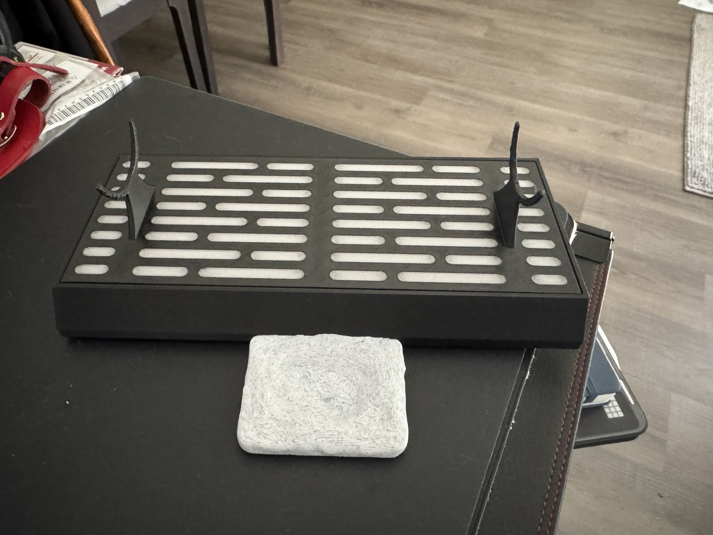
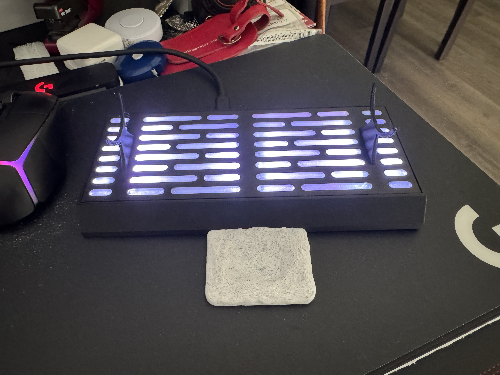
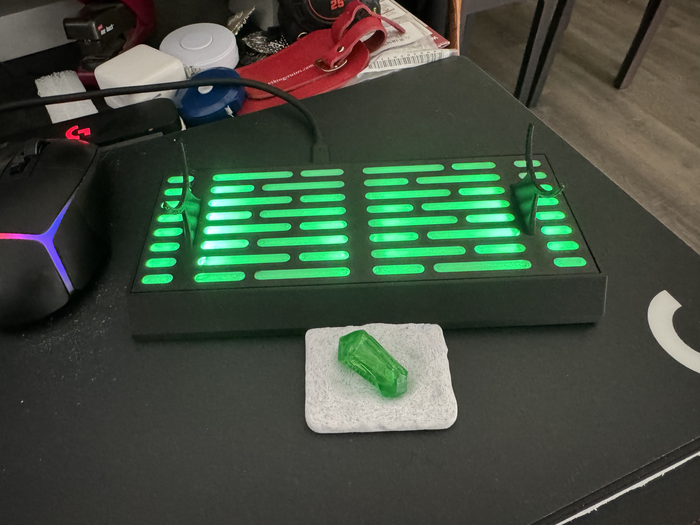
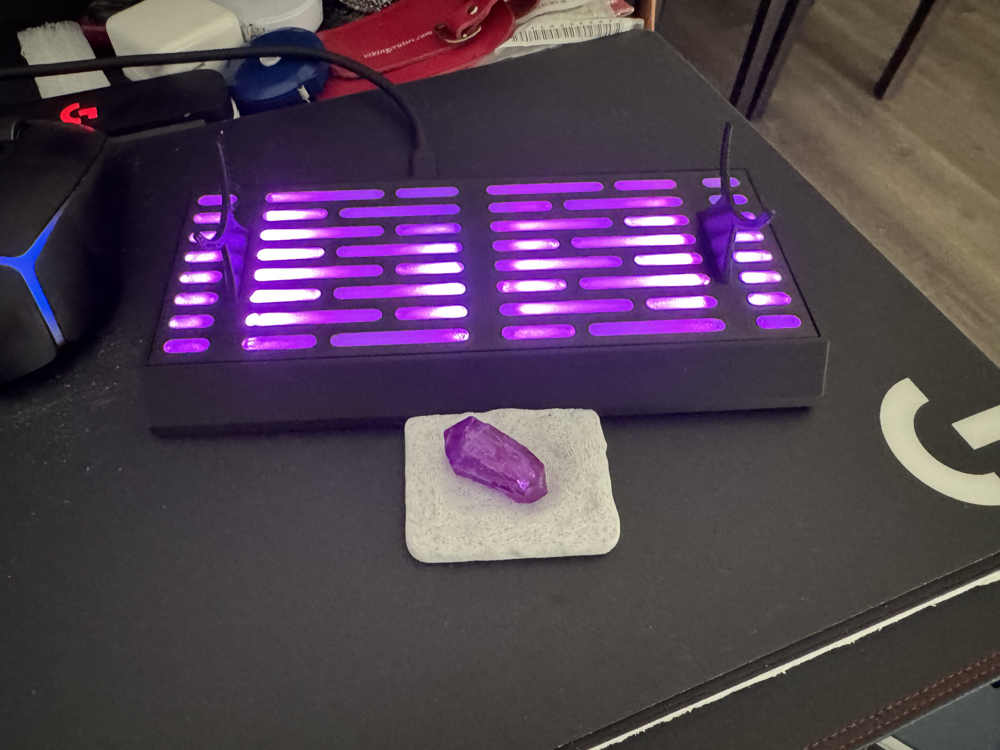
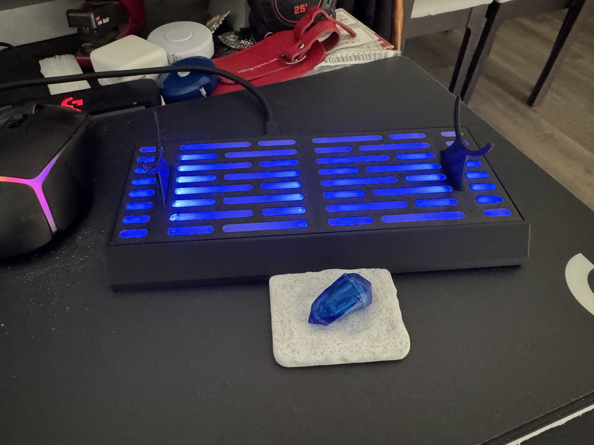
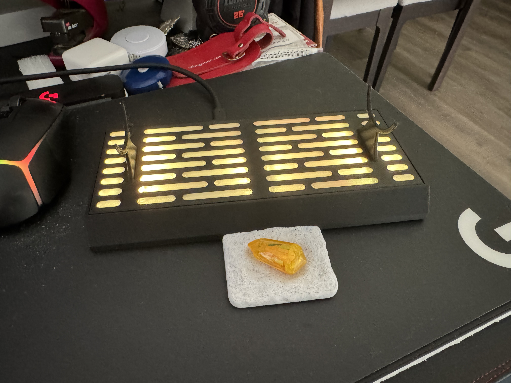
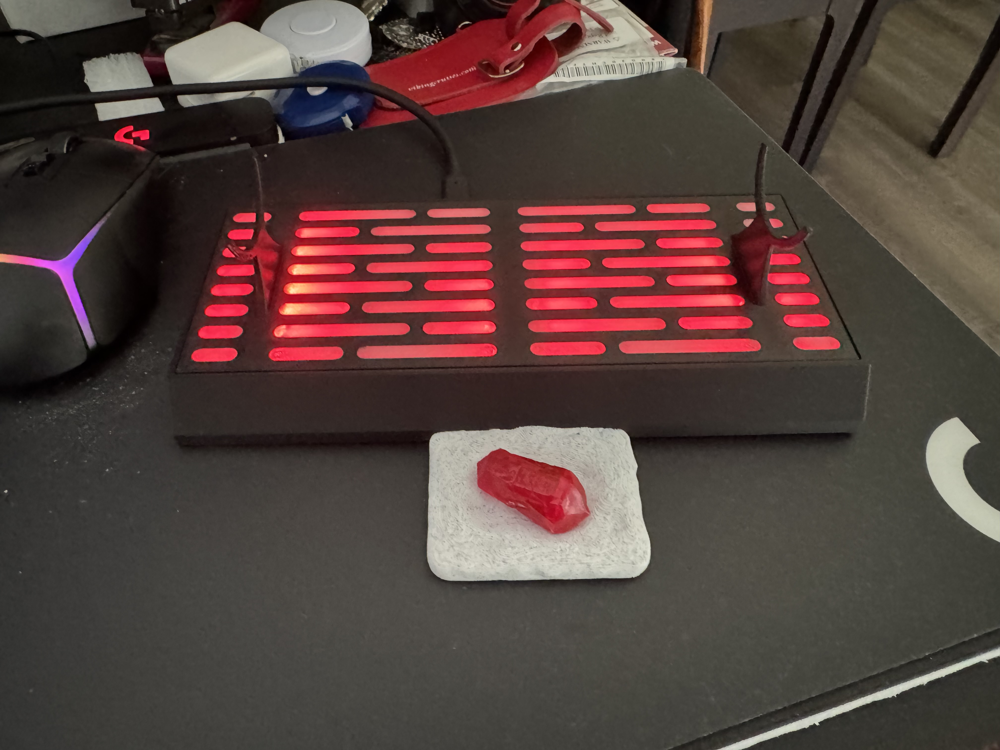
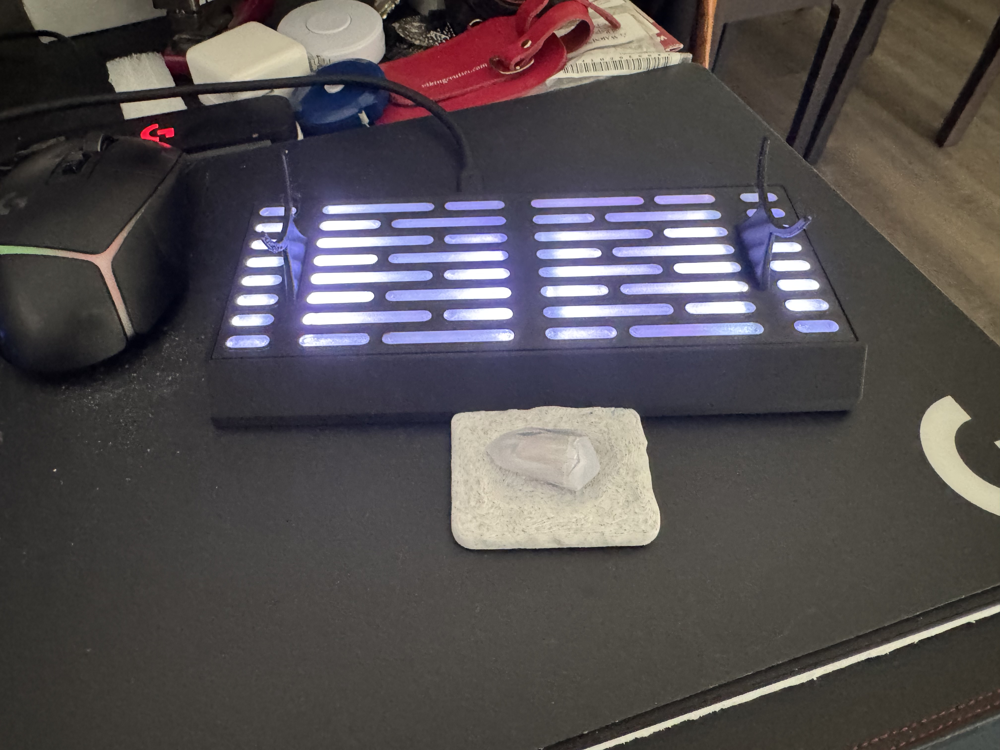
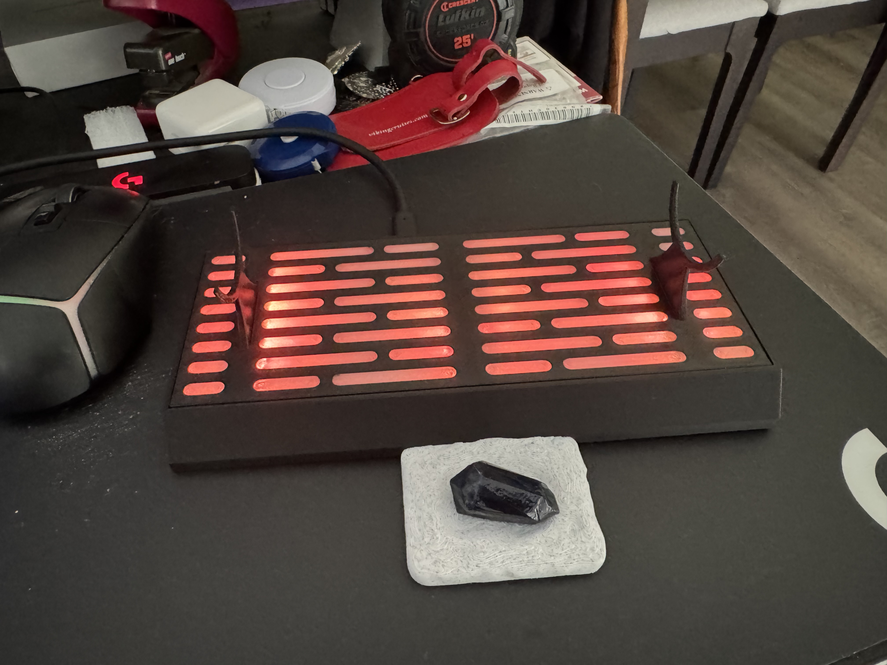

# Light Saber Stand with Kyber Tray
This is something I was hoping Disney would have come out with.  I guess the demand for something like this was not high enough to warrent a disney SWGE version.

After a Failed attempt to visit Batuu East, and a long car ride back to Texas.  I came up with this idea for a project.

I ran accross this Lightsaber Stand w/LED Customization Option by Pneulegend on Makerworld.com and decided this was what I would base the design from.  https://makerworld.com/en/models/1560410-lightsaber-stand#profileId-3048396

List of items I ended up using.
- Seeed Studio XIAO-ESP32-S3 (micro Controller)
- 3 x 1x8 NeoPixel strips (https://www.amazon.com/DIYmall-Integrated-Drivers-forArduino-Raspberry/dp/B0BWH95XSH/ref=sr_1_1?crid=5M8S3DOFV82G&dib=eyJ2IjoiMSJ9.DU1lHDq6iuyF3tXhkHamvviqbK0XSCs41yLF2EKgKTebm2IgrIPmk_b68i9887NgtYld_yfa2ekrjaVawJH9G4BBRu_mznEKwKPNSW_08YMZlQ4v74BhasafKYIlTolmRPVDNiyzOe9t_04vOwqUrNLwnEqVrxoUkZHlDZqw3Dz3LKPZQMF2YFg36BEFYEJ1tHp3m-HhzvuZBzMUDkXX7L5pxnfP3XO11BePJYythAmmLDznY0YHmSJFRbHqWsQJmYd1NR3Tv7i6u2NADGIcl3tp6jGjHDQg76L0ZoUeWaI.p0fzN8sRKTUsKIa5jPlnNpBa_HPWB3f__a7MFRmUla8&dib_tag=se&keywords=Neopixel+strips+1x6&qid=1782233750&sprefix=neopixel+strips+1x6%2Caps%2C295&sr=8-1)
- RDM6300 125khz RFID Reader ([rdm6300 125khz RFID Card Read Module with em4100 Support for arduino - uart Serial](https://www.amazon.com/dp/B0FDLFTGF9?ref=ppx_yo2ov_dt_b_fed_asin_title))
- Bambuu Labs PETG Black Filiment
- Overture PETG Transparent Filiment
- Bambuu Labs Basic PLA Black Filiment
- Bambuu Labs Basic PLA Stone Filiment

After makeing sure my idea was something I was going to be albe to make work I started modifing the models that Pneulegend had provided on maker world.  At first it was just a few minor tweaks to add the transparent aspects to the top and connect the stands for a single print.
I pulled the Crystal Cradle OBJ file from OldManSpock's Star Wars Galaxy's Edge: Savi's Workshop Lightsaber Stand on Thingiverse to add to the front of the stand. (https://www.thingiverse.com/thing:3743753/files)

After reciving all the parts I did some mesuring and modified the 3d Models to accept the parts and printed everything.  the only reason I used PETG for the top portion of the print was that was all the transparent filiment I had and did not want to mix PLA and PETG for ovious resons.

The idea was to have a Kyber Crystal in the cradle to change the color of the stand.  To make things a little diffrent I use an unstable effect for the Black crystal so it is not a steady read but what looks like an unstable blade.

## Images

### the Black crystal effect is not well showen in the image but it is a random flickering.

If you find any issue or have suggestions to improve on this project please let me know.
